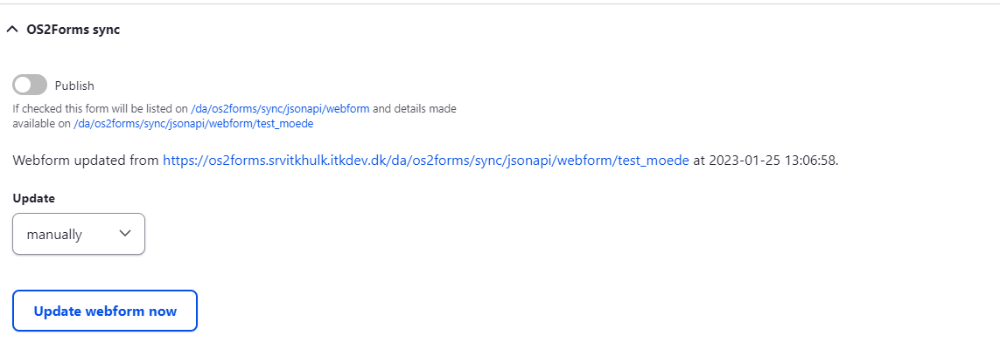

Hent formular på din installation 

Trin | Handling | Illustration  
---|---|---  
1 | Gå til Indstillinger => OS2forms Sync => See webforms available for import. [site]/da/admin/os2forms/sync/webform.   
Her vises alle de formularer som andre installationer har udstillet til dig. |   
2 | Du kan søge på url og titel, for at hjælpe dig med at vælge en formular. Det er også muligt at se lidt nærmere på hvad formularen består af. |   
3 | Vælg "Importer formular" |   
4 | Formularen er nu importeret og du er sendt hen til siden med dens elementer. |   
5 | Standard opdateringsfrekvensen er sat til at det skal ske manuelt af en bruger. |   
  
**Opdatering**

Du kan vælge hvordan du ønsker at formularen bliver opdateret fra kilden.På din importerede formular, har du mulighed for at dels ændre konfigureringen for opdatering og for at lave en manuel opdatering. 

Trin | Handling | Illustration  
---|---|---  
1 | Gå til indstillinger på din hentet formular. |   
2 | Find OS2forms sync |    
3 | Vælg "Update manually now", for at tjekke formularen for opdateringer.   
Formularen bliver opdateret og du kan finde "den gamle version" af formularen under revisioner. [site]/da/admin/structure/webform/manage/[formular]/revisions |   
4 | Alternativt kan du vælge en frekvens den opdaterer formularen løbende med i dropdown "Update". |