Vi vil her lave et flow bestående af 2 formularer, en initierende (formular 1) og en godkendelses formular (formular 2). Formular 2 kan udfyldes af borgere, virksomheder og anonyme, som kan kendes på CPR, CVR eller e-mail.

  1. [Opret første formular](../opret-formular.md) (formular 1)
  2. [Kopier formular til din godkendelses formular](../kopier-formular.md) (formular 2)
  3. [Sørg for at begge formularer har tilknyttet en selvbetjeningsside](../opret-selvbetjeningsside-indhold.md)

Når du har styr på dine formularer er du klar til at starte på dit flow. 

  
**Opsætning af flow**

Du skal lave et flow som ser ud som nedenstående:  
****

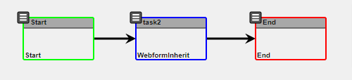

Trin |  Handling |  Illustration  
---|---|---  
1 |  Gå til Flow skabeloner og klik "tilføj skabelon" |    
2 |  Udfyld skabelon informationer.   
  
**Etiket** på skabelon processen bliver vist for system-brugerne i /taskconsole. Den bliver ikke vist for borgere.  
  
Alle felterne kan redigeres senere, ligesom der skal tilføjes variabler, hvis dit flow har behov for det.  |  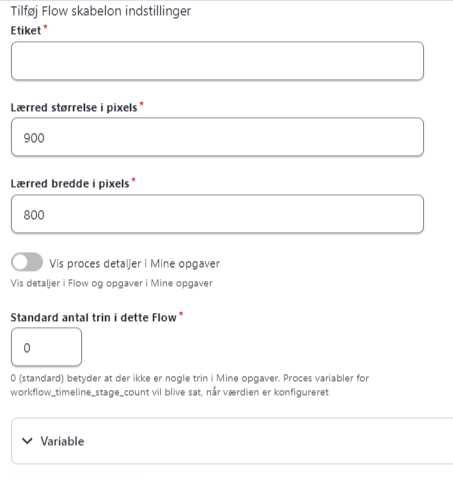  
3 |  Vælg "Tilføj opgave" og "Webform with Inherited submission" i det vindue som kommer op. Du skriver yderligere en titel, som bruges i opgavelisten på /taskconsole.  |  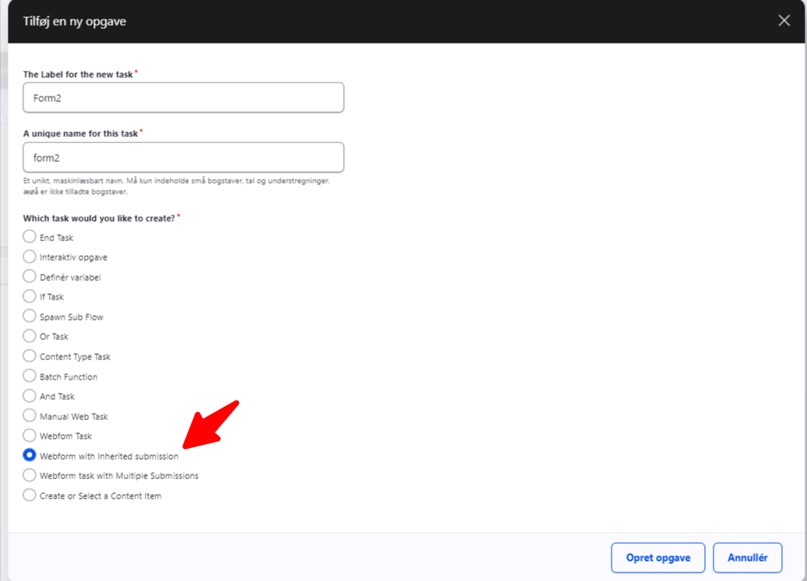  
4 |  Opsæt webform inherit, ved at klikke på de tre streger i øverste venstre hjørne af opgaven.  
Her skal du sætte nedenstående  
  
**The label of the task** : Titel, som brugeren (system-brugeren) ser, når de ser opgaven på deres /taskconsole  
  
**Formular** : Den formular som er næste trin på processen vælges her  
  
**Unique identifier** : Her skrives en unik nøgle for hver besvarelse. Det skal hjælpe med at adskille denne besvarelse for andre tidligere besvarelser.  
  
Standard identifieren for første formular vil altid være "submission", og det bør derfor ikke være det samme.  
  
**Show the edit form** , if submission already exists: Denne skal være deaktiveret. **Webform attached to a node?** Denne skal aktiveres og du skal sørge for at der er node koblet til formularen, da den skal kobles på her.  **Skip Any Maestro Webform Submission Handlers** skal aktiveres.  **Return path** : Når man "løser" sin opgave, ved at trykke gem, er standarden at den går til at taskconsole (som dog kun er muligt for godkendte brugere som har adgang til). Det muligt at ændre til interne url'er. Fx kan du oprette en selvbetjeningsside, som du kan skrive i feltet, fx. node/12 (så url virker uagtet domæne og om siden skifter navn).   
NB: hvis det driller er det også muligt på formularen, at bekræftelsen til at den bliver indlejret på formularen i stedet for at den er en ny side.  
  
**Inherit webform from** : Her vælges den "unique identifier" som er brugt på tidligere formular. Standard identifieren for første formular vil altid være "submission".   
  
**Create submission** : Denne skal være deaktiveret **Assignee og Notification (assignee)** : Det er forskelligt hvad du skal gøre alt efter hvem der skal modtage en opgave. 

  * Kendt bruger: hvis det altid er de samme som skal håndtere opgaven, kan du skrive deres brugernavn.
  * Ikke kendt bruger: Sæt til brugerrollen Borger eller Virksomhed

Du skal ikke skrive en notifikations titel og tekst her. Den vender vi tilbage til om lidt.  |  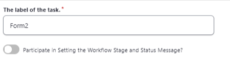   
  
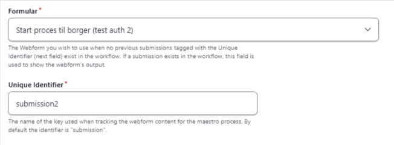   
  
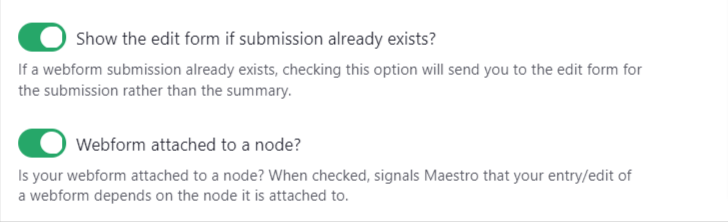   
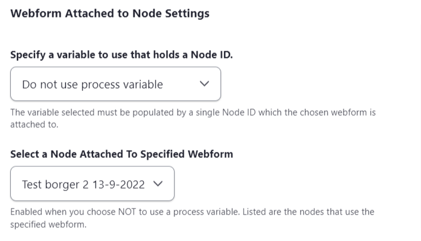   
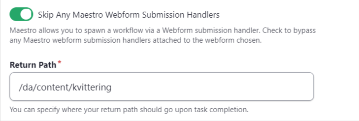 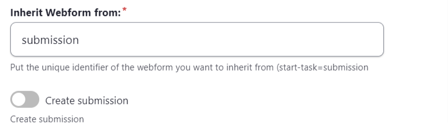 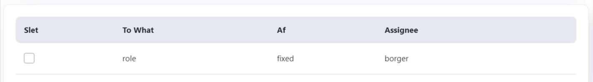  
5 |  Forbind linjerne mellem opgaverne, når du har opsat de nødvendige opgaver.  |  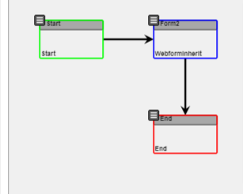  
6 |  Validér flow, ved at klik "Validity check" og derefter gemme ved at klikke på "Save template validity"  |  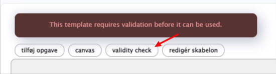   
  
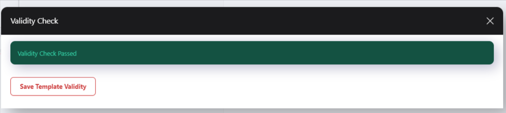  
7 |  Flow er nu færdige.  |   
  
**Formular 1 færdiggørelse**

Formular 1 mangler nogle handlere, for at flowet kan køre som det skal. 

Vi skal have

  1. [Tilføjet flowet til formular 1](tilføj-flow-til-formular.md)
  2. [Opret notifikation til part 2](opret-flow-notifikationer.md)

**Formular 2 begræsning**

Du bør vurdere hvilken data du sender videre i formularen og om der skal ekstra validering ind over at det er den rigtige som udfylder formular.

  * Valider adgang til formular

**Test**

Når alt dette er opsat kan du udfylde din første formular og teste at det kan køre igennem fra start til slut.

**NB** : ovenstående kræver at Orchestrator er opsat, da cron jobbet skal køre, for at gøre "opgaverne" klar til borgeren.