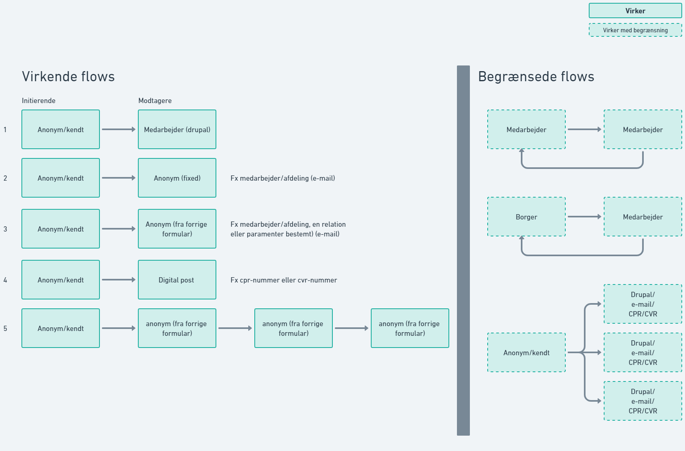

Maestro som OS2forms er bygget på kan utrolig mange ting ud af boksen, så det er værd at kigge på [Nexttide guides](../hvor-finder-jeg-god-inspiration-fra-nexttide-vedr-flows.md).

OS2forms har bygget ekstra ovenpå som gør at vi kan have forskellige aktører på samme formular uden at give mulighed for at redigere i formular/indsendelse. Der er dog lidt flere begrænsninger i denne funktion, som det ses nedenfor på billedet.

