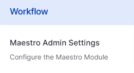
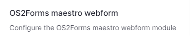
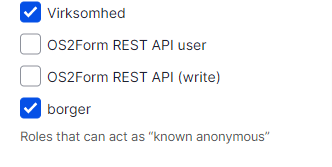

Denne vejledning skal følges af en administrator. 

Trin | Handling | Illustration  
---|---|---  
1 |  Gå til Indstillinger => Maestro Admin settings [site]/en/admin/config/workflow/maestro |    
2 | Aktivér Send out notifications |   
3 | Aktivér Run the Orchestrator on Task Console Refreshes |   
4 | Sørg for at der står en token i The token that MUST be appended to the /orchestrator URL in order to run the orchestrator. |   
5 | Skriv en tekst i Provide a site-wide token key for use in the URL as the key in a key-value pair.   
  
Fx opgave |   
6 | Aktivér Enable Zero-User notification mechanism. |   
7 | Klik Gem |   
  
Yderligere skal administrator sætte hvilke brugere, der kan modtage notifikationer uden at være logget ind. Det gøre her:

Trin | Handling | Illustration  
---|---|---  
1 | Gå til Indstillinger => Os2forms maestro webform |    
2 | Vælg de roller som du ønsker skal kunne modtage notifikationer uden at være brugere |    
3 | Gem indstillinger |