Det er muligt at styre hvordan visningen på opgavelisten skal være. Det gøres i template indstillingerne.

**Uden detaljer**

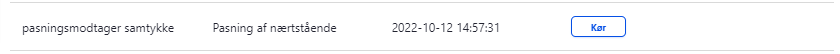

Trin | Handling | Illustration  
---|---|---  
1 | Gå til dit flow og klik "rediger skabelon" |  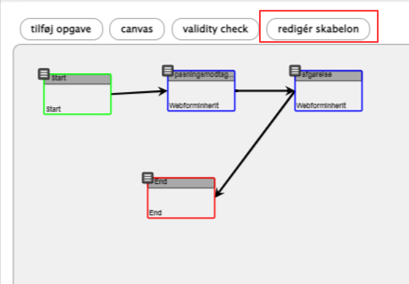  
2 | Sørg for at "Vis proces detaljer i Mine opgaver" er deaktiveret |  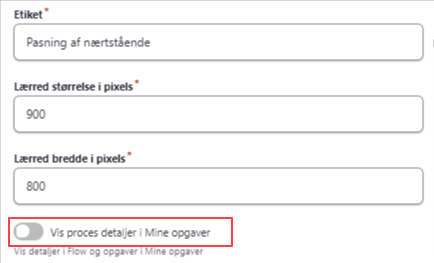  
3 | Klik "Opdater skabelon" |    
4 | Det ændrer på alle aktive opgaver, hvad der vises. |   
  
**Med links til tidligere indsendelser**

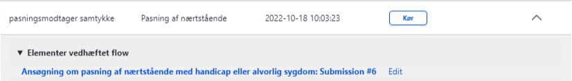

Dette kræver stadig de rette rettigheder i OS2forms, for at kunne se data.

Trin | Handling | Illustration  
---|---|---  
1 | Gå til dit flow og klik "rediger skabelon" |    
2 | Sørg for at "Vis proces detaljer i Mine opgaver" er aktiveret |  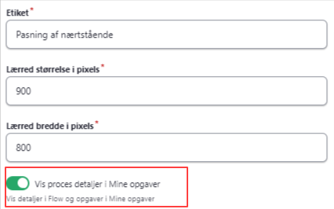  
3 | Vælg "Elementer vedhæftet flow" som en detaljevisning |  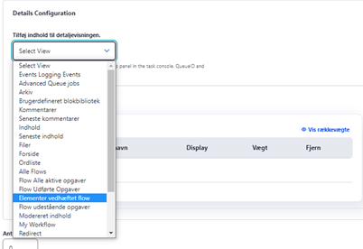  
4 | Klik "Opdater skabelon" |    
4 | Det ændrer på alle aktive opgaver, hvad der vises. |   
  
**Med proces visning**

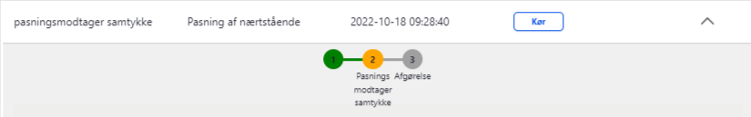

Vær opmærksom på at denne ikke er optimal for webtilgængelighed, så bør ikke bruges ved synshandicappede borgere eller medarbejdere.

Trin | Handling | Illustration  
---|---|---  
1 | Gå til dit flow og klik "rediger skabelon" |    
2 | Sørg for at "Standard antal trin i dette Flow" er sat til over 0.  
Fx 3 ved dette flow, da der kun kan laves opgaver for hver flow opgave der er.  |  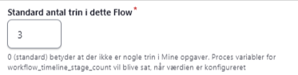  
3 | Klik "Opdater skabelon" |    
4 | Nu skal vi have navne på opgaverne. Rediger hver af dine elementer (blå kasser i flow) ved at klikke på streger efterfulgt af "Rediger opgave" |  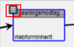  
5 | Aktiver "Tildel Flow trin og flow overskrift" |  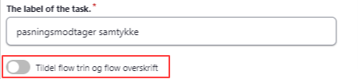  
6 | Der kommer en ny sektion under feltet. Sæt trin og hvilken overskrift du ønsker bliver vist. |  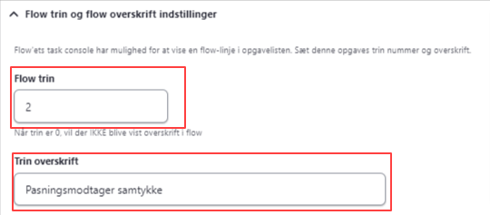  
7 | Klik "gem opgave" |    
8 | Du kan nu se at din opgave har fået trin synligt på oversigten |  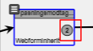  
9 | Gentag 4-8 på alle dine trin, for at nå den ønskede liste i Opgavelisten. |   
10 | Dette ændres kun på fremtidige opgaver og kan ikke ændres på eksisterende opgaver.  |