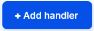
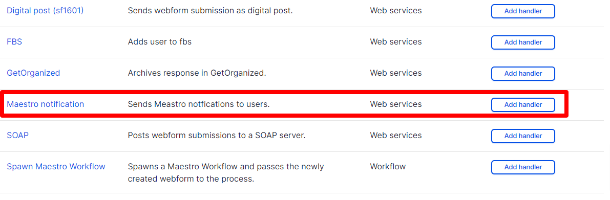
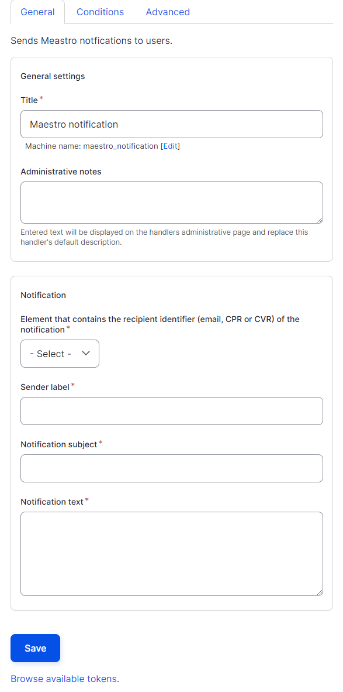
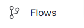
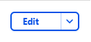

**Notifikationer til borgere, virksomghedere og medarbejdere (uden drupal adgang)**

Det er muligt at få et direke link til en opgave i stedet for skulle igennem "/taskconsole". Det kan være relevant når opgave-modtagere ikke er brugere i din os2forms installation, da borgere ikke vil få mange opgaver. 

For at det virker skal du også igennem denne vejledning:

[flow-med-data-paa-tvaers-af-formularer](flow-med-data-pa-tværs-af-formularer.md)  
  
Notifikationen skal laves på din initierende formular (som er før den opgave som skal sendes ud), skal du gøre følgende:

Trin | Handling | Illustration  
---|---|---  
1 | Gå i Indstillinger, derefter e-mail/handlers  
[site]/admin/structure/webform/manage/[formid]/handlers |   
2 | Tilføj handlers  |    
3 | Tilføj Maestro notifikation |    
4 |    
Udfyld   
  
**Titel** : Genkendeligt navn til administrativt brug  
**Element that contains the recipient identifier (email, CPR or CVR) of the notification:** Det formularfelt du har modtager-oplysninger i. Hvis der vælges e-mail sendes der en e-mail. Hvis der vælges cpr eller cvr nummer, vil der sendes digital post.   
**Sender label:** Den afsender som besked skal komme fra.  
**Notification subject:** Dit emne på beskeden*  
 **Notification text:** Her skriver du din besked.    
|    
5 |  I Notification text indsætter du nedenstående, for at genere den unikke url i din opgave-modtager skal udføre næste opgave.  [maestro:task-url] |   
6 | Klik gem i bunden af feltet, når du har skrevet resten af din besked. |   
  
Ved dette har du lavet en notifikation som bliver sendt til modtageren som står på din formular og modtageren får først notifikationen når opgaven faktisk er klar til dem. 

**Notifikationer til medarbejdere (drupal brugere)**

Hvis du skal sende notifikationer til drupal brugere kan du både ville trække dem til /taskconsole og direkte til opgaven. Det kan være du har en række brugere som der skal vælges mellem eller en specifik bruger eller en gruppe som skal have den. Vi gennemgår begge dele nedenfor.

Trin | Handling | Illustration  
---|---|---  
1 | Gå Flows og vælg redigér dit flow, du vil sætte notifikationer på |     
  
2 | Vælg opgave som skal give en notifikation og rediger opgaven |    
3 |  Gå ned til assignment og sørg for at brugerne for adgang til den opgave du vil give dem.  
  
**Specifik bruger**  
Start med at skrive navnet på den bruger, som skal modtage opgaven. Vælg når navnet kommer. **Gruppe brugere**  
Start med at skrive navnet på brugeren. Vælg og gentag for alle de brugere, som skal modtage opgaven   
  
**Ukendt drupal bruger**(fx fra tidligere formular)  
Ændre "assign by" til variabel. Vælg din [tidligere oprettet variabel](variabler-i-flow.md). |   
4 | Gå ned til notifications og vælg de samme brugere som ovenfor. |   
5 |  Længere nede i notificationerne kan du definere, hvad du vil sende i notifikationen. Hvis du ikke skriver noget, kommer der en standard tekst om at der er en opgave.  
Du udfylder emne og besked   
Hvis du vil have brugeren direkte til opgaven skriver du i besked-feltet: [mastro:task-url]  
Hvis du vil have brugeren til taskconsole skriver du i besked-feltet: [site:url]/taskconsole |   
6 | Klik Gem opgave |   
  
Virker det stadig ikke så få din adminstrator til at tjekke at:

[/konfiguration-af-flow-motor-maestro](konfiguration-af-flow-motor-maestro.md)

Er udført på løsningen.