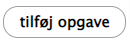
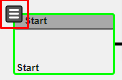

Trin | Handling | Illustration  
---|---|---  
1 | Gå til Maestro template list (/maestro/templates/list) |   
2 | Vælg det flow du vil redigere ved at klikke "tilpas skabelon" ud for dit flow. |    
4 | Klik "Tilføj opgave" over det grå felt.  |    
5 |  For at rediger og trække forbindelser mellem opgaverne, skal du klikke på menuen i øverste venstre hjørne af hver opgave. Det er forskelligt hvilke funktioner som er i hver opgave-type og hvilken type forbindelser du kan lave for hver opgave. [Se Maestros gennemgang af opgave-typer.](https://www.drupal.org/docs/8/modules/maestro/task-types-overview) Obligatoriske felter er altid markeret med en rød stjerne. |    
6 | Dine rettelser eller tilføjelser til opgaveforbindelse gemmes automatisk løbende. Opdatering af de enkelte opgaver gøres ved at klikke "Gem". |   
7 |  Klik "validaty check" og, hvis den godkendes, klik "Save template validity" Når dit flow er godkendt kan du begynde at bruge det. |