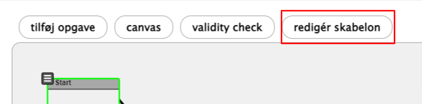
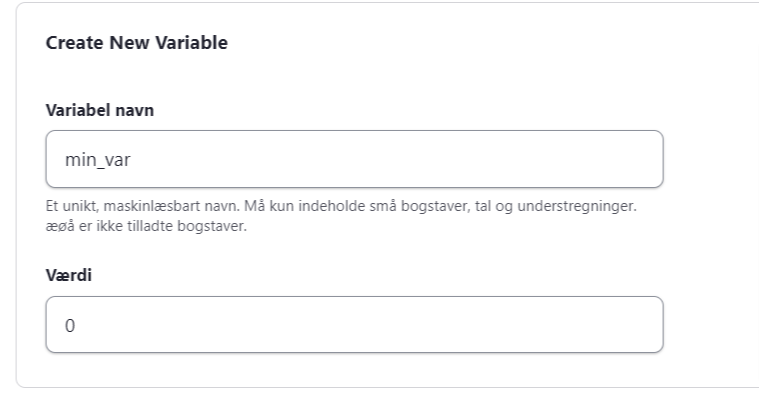
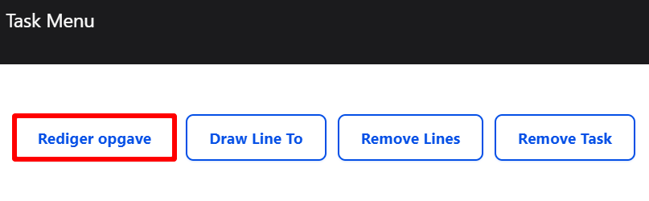
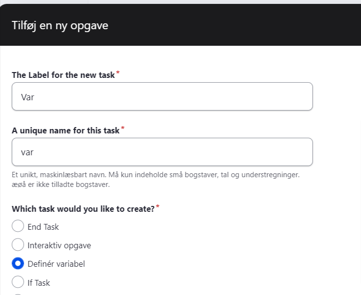
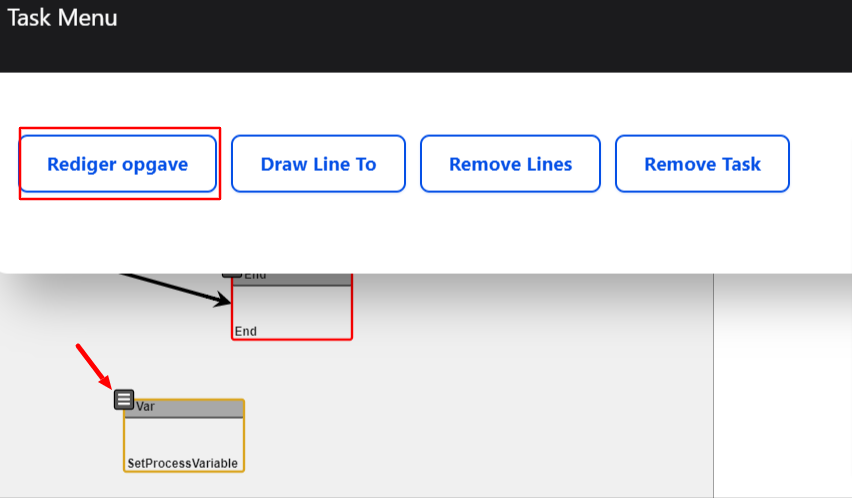
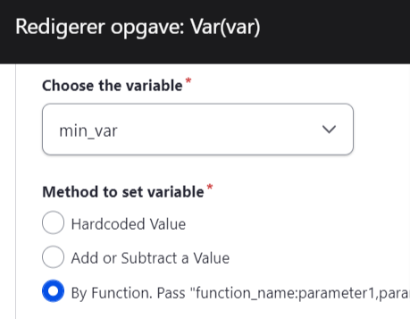
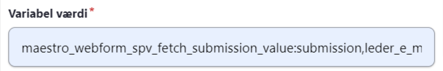

Man kan fx bruge variabler til at kunne oprette formular-værdier som skal afgøre hvordan flowet skal virke. 

**Opret variabel på Flow skabelon**

Trin | Handling | Illustration  
---|---|---  
1 | Gå ind i det Flow du ønsker skal bruge variabel |   
2 | Klik "redigér skabelon" |    
3 | Udfold "Variable" |   
4 | Opret ny variabel ved at give den et navn og en værdi, fx. min_var og "0"  
  
Det er en god idé at give din variabel en værdi, så du kan se om den bliver overskrevet eller der aldrig sker noget med den. |    
5 | Gem |   
  
**Opret variabel i flow**

Trin | Handling | Illustration  
---|---|---  
1 | Du står på Flowet og klikker "tilføj opgave" |    
2 | Navngiv opgaven, fx var og vælg typen "definér variabel".  
  
Klik "Opret opgave" |    
3 | Herefter skal opgaven opsættes, ved at klikke på de tre streger (se pilen) og derefter "Rediger opgave" |    
4 |  Vælg din variabel i "Choose the variable" og vælg hvordan variablen skal sættes. Hardcoded Value: En fast værdi Add or Substract a Value: Mulighed for at regne værdi ud By function: Mulighed for at hente fra systemet eller fra en formular. |    
5 |  Hvis du vil hente en værdi fra en tidligere formular, skal du vælge "by Function..." og skrive:  **maestro_webform_spv_fetch_submission_value:submission,[element-nøgle]**  
  
NB: Hvis variablen defineres efter 2. formular og der bruges webform-inherit, vil "submission" skulle ændres til den defineret submission på den formular variablen laves ud fra. **maestro_webform_spv_fetch_submission_value:[unique identifier for submission],[element-nøgle]**  
  
Fx.  
maestro_webform_spv_fetch_submission_value:submission2,leder_email |  