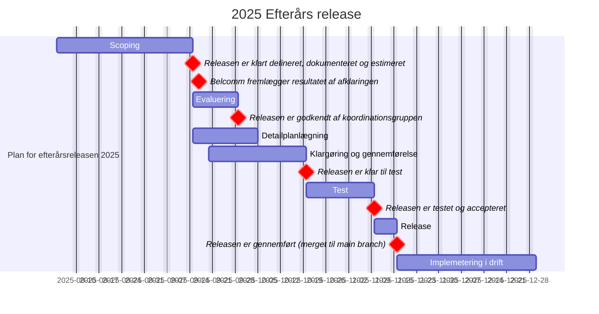

# Efterårsrelease 2025 - oplæg til koordinationsgruppen

Overblik over efterårsrelease til koordinationsgruppens videre arbejde.

Milepæle:
  - 15.09.2025: Releasen er klart defineret, dokumenteret og estimeret
  - 29.09.2025: Releasen er godkendt af koordinationsgruppen
  - 20.10.2025: Releasen er klar til test
  - 10.11.2025: Releasen er testet og accepteret
  - 17.11.2025: Releasen er gennemført (merget til main branch)
---

## [#196](https://github.com/OS2Forms/os2forms/issues/196): Diskussion og fastlæggelse af sikkerhedsopdateringer og løbende vedligehold

1. **[#200](https://github.com/OS2Forms/os2forms/issues/200): Modulet "CKEditor 4 (contrib) (ckeditor)" bør erstattes (af "CKEditor 5 (ckeditor5)") da det er deprecated**

   * Afventer svar fra ITK (som har prøvet CKEditor 5 af)

2. **[#205](https://github.com/OS2Forms/os2forms/issues/205): Modulet "@fontyourface (fontyourface)" bør fjernes da brugerne afgiver cookies**

   * Bellcoms anbefaling er at benytte “@fontyourface - Local Fonts (local\_fonts)”, hvis der stadig ønskes en bestemt font i OS2forms. Estimat: 0,00 timer. De anvendere som ønsker at skifte til at bruge “@fontyourface - Local Fonts (local\_fonts)” kan kontakte Bellcom for estimat på opgaven på deres installationer

## [#194](https://github.com/OS2Forms/os2forms/issues/194): Diskussion og fastlæggelse af udfasninger af moduler

1. **[#207](https://github.com/OS2Forms/os2forms/issues/207): Verificer at moduler der ikke kompatibel med Drupal 10 kan udfases (15 stk.)**

   * Alle de nævnte moduler kan fjernes. Estimat: 6,00 timer

2. **[#209](https://github.com/OS2Forms/os2forms/issues/209): Undersøg om moduler der ikke anvendes og ikke er omfattet af central vedligehold kan fjernes (17 stk.)**

   * 4 af modulerne kan fjernes. De andre moduler er enten core moduler i Drupal eller moduler som andre core moduler er afhængige af og derfor anbefaler Bellcom at disse moduler bliver en del af den centrale vedligeholdelsesaftale. Estimat: 2,00 timer

3. **Undersøg om moduler hvor brugeren afgiver cookies (noncompliant med GDPR) kan fjernes (6 stk.)**

   * Disse moduler kan ikke fjernes, hvis man stadig ønsker at “@fontyourface - Local Fonts (local\_fonts)” skal kunne benyttes. Estimat: 0,00 timer

## [#210](https://github.com/OS2Forms/os2forms/issues/210): Diskussion og fastlæggelse af tilpasning af moduler

1. **Ændring af navne på elementerne der i dag indeholder navnet "NemID", da "NemID" ikke længere eksisterer. Ændringen må dog ikke få konsekvenser for eksisterende formularer/installationer. Nyt navn foreslås til "MitID"**

   * Ud fra Bellcoms anbefaling så er der 2 mulige løsninger på dette. Estimat: 2,00 til 4,00 timer (afhængig af valgt løsning)

2. **Modulet "OS2web nemlogin Automated Logout" bør som standard være aktiveret i en OS2forms installation**

   * Ingen hindring for Bellcom. Estimat: 0,00 timer

3. **[#188](https://github.com/OS2Forms/os2forms/issues/188): OS2forms sync modul not working**

   * Estimat: ITK har lavet review på Bellcoms rettelse og det er merged ind i deres kode. Bellcom skal bruge 2,00 timer på at sikre at modulet kommer ind med det nye tag/rettelse i OS2forms

## [#197](https://github.com/OS2Forms/os2forms/issues/197): Diskussion og fastlæggelse af udvikling bestilt af OS2 fællesskabet

1. **[#206](https://github.com/OS2Forms/os2forms/issues/206): Release af Digital Signatur**

   * Afventer internt review hos Bellcom. Estimat: 0,00 timer

## [#198](https://github.com/OS2Forms/os2forms/issues/198): Diskussion og fastlæggelse af bidrag fra Aarhus Kommune/ITK

1. **[PR #101](https://github.com/OS2Forms/os2forms/pull/101): Keys and encrypt**

   * Review er lavet og faktureret af Bellcom i juni 2025 - kommer automatisk med ved release

2. **[#170](https://github.com/OS2Forms/os2forms/issues/170): Implement MeMo1.2 compliance \[SFRMS-129]**

   * Estimat: 3,50 timer til review (review er lavet og faktureret i august 2025, som aftalt på scopingmøde den 27/8-2025)

3. **[#183](https://github.com/OS2Forms/os2forms/issues/183): Fix: Webform Auto Exports settings issue**

   * 0,00 timer til review (review er lavet - gratis fra Bellcom)

4. **[#186](https://github.com/OS2Forms/os2forms/issues/186): Fix: Name- and address protection multiple submission saves issue**

   * Estimat: 2,25 timer til review

5. **[#190](https://github.com/OS2Forms/os2forms/issues/190): Fix: os2forms\_forloeb: Send Maestro notification handler exception handling when sending digital post**

   * Estimat: 1,00 timer til review

6. **[#195](https://github.com/OS2Forms/os2forms/issues/195): Fix: os2forms\_forloeb: Maestro notification attempts sending digital post that will never be delivered**

   * Estimat: 1,00 timer til review

7. **[#218](https://github.com/OS2Forms/os2forms/issues/218): Fix: MitId Children select missing a succesful check**

   * Estimat: 0,75 timer til review

8. **[#219](https://github.com/OS2Forms/os2forms/issues/219): Fix: Maestro notification handler ignores conditions (vilkår)**

   * Estimat: 0,75 timer til review

9. **[#221](https://github.com/OS2Forms/os2forms/issues/221): Fix: Maestro digital post-notification sender label is set incorrectly**

   * Estimat: Afventer estimat fra Bellcom

## Diskussion og fastlæggelse af bidrag fra Bellcom

Intet pt.

## Ikke inkluderet i denne release

   * Opgradering til Drupal 11
   * Opdatering til Maestro 4.1.4
   * Defination af et Core theme / core font

## Udestående (mangler opfølgning)

   * Integration til Fordelingskomponenten
   * Drupal 10. Vilkår baseret på Computet twig virker ikke længere
     
